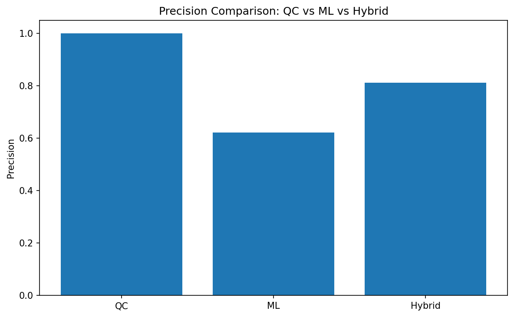
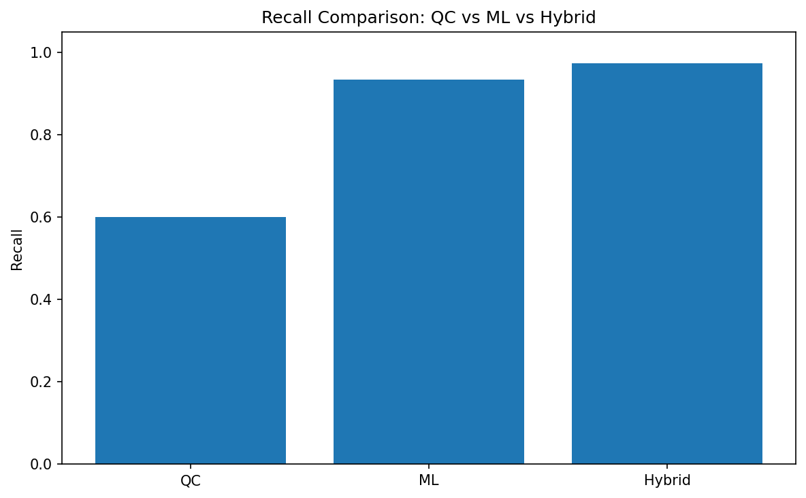
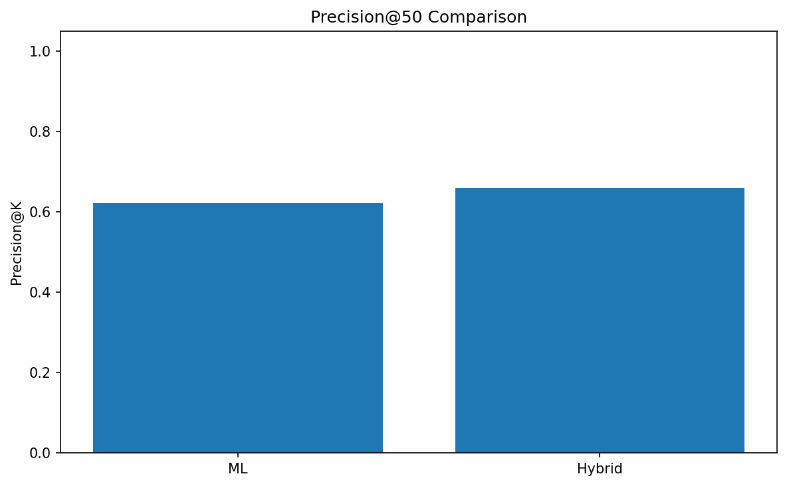
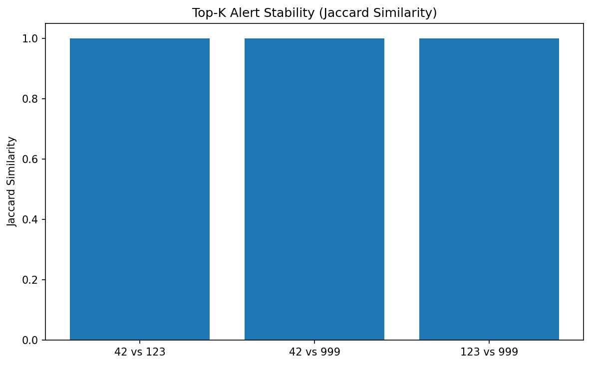
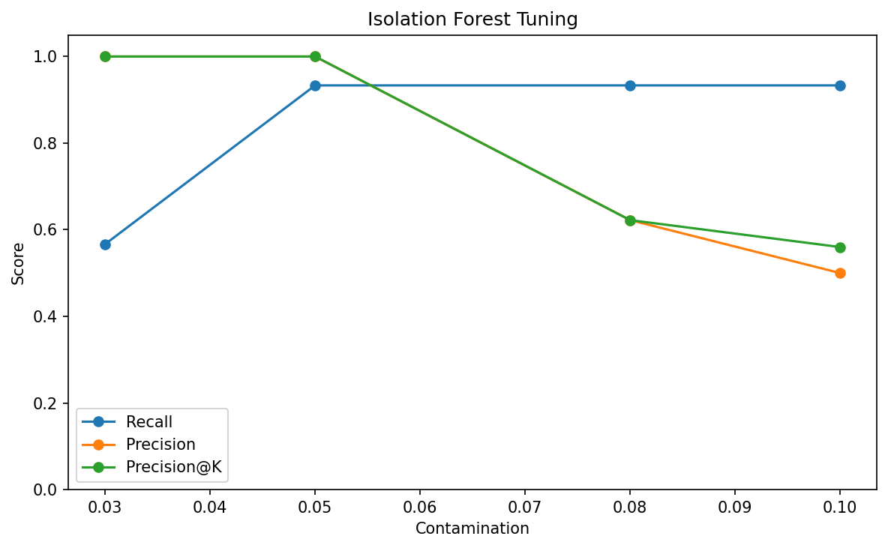

# LabSentinel — Hybrid Data Quality Monitoring (QC + ML)

## 🚀 Key Result

Hybrid QC + ML achieved:

* **97% recall**
* **81% precision**
* **fully stable anomaly ranking**

→ outperforming both standalone QC and ML approaches

---

## Overview

LabSentinel is an end-to-end data quality monitoring system for laboratory measurements.

It combines:

* **rule-based validation (QC)**
* **unsupervised anomaly detection (ML)**

to improve detection of both **hard data errors** and **subtle anomalies**.

---

## Problem

Traditional data quality systems rely on static rules:

* range checks
* completeness checks
* unit validation

These approaches work well for **hard errors**, but fail to detect:

* contextual anomalies
* near-boundary issues
* subtle distribution shifts

In real-world systems, these undetected issues can lead to:

* incorrect analytics
* poor model performance
* faulty business decisions

---

## Solution

LabSentinel introduces a **hybrid detection architecture**:

### 1. QC Layer (Rule-Based)

Detects deterministic issues:

* missing values
* incorrect units
* invalid dates
* out-of-range values

### 2. ML Layer (Unsupervised)

Detects non-obvious anomalies using:

* relative position within expected range
* parameter-level z-score
* product-parameter z-score

Model:

* **Isolation Forest**

### 3. Hybrid Layer

Combines QC + ML alerts to:

* maximize recall
* maintain acceptable precision
* detect both hard errors and soft anomalies

---

## Architecture

The system is designed in a modular way, allowing independent extension of QC rules,
ML models, and evaluation logic without impacting the overall pipeline.

Pipeline:

```
Generator → Cleaning → QC → Feature Engineering → ML → Hybrid → Evaluation
```

Main modules:

* `labsentinel.generator` — synthetic data generation with injected errors
* `labsentinel.pipeline` — full processing pipeline
* `labsentinel.features` — ML feature engineering
* `labsentinel.evaluation` — metrics computation
* `labsentinel.gx_runner` — data validation (Great Expectations)

---

## Reproducibility

### Generate dataset

```bash
python -m labsentinel.generator --seed 42 --rows 600 --out data/raw/lab_measurements.csv
```

### Run full pipeline

```bash
python -m labsentinel.pipeline --input data/raw/lab_measurements.csv --seed 42 --k 50
```

Configuration is saved in:

```
data/processed/<run_id>/run_config.json
```

---

# 📊 Results & Key Findings

## 🔍 Performance Comparison

| Approach | Recall   | Precision | Notes                     |
| -------- | -------- | --------- | ------------------------- |
| QC       | 0.60     | 1.00      | Misses soft anomalies     |
| ML       | 0.93     | 0.62      | Strong on subtle patterns |
| Hybrid   | **0.97** | **0.81**  | Best overall performance  |

---

## 🎯 Precision@K (Top Alerts Quality)

| Method | Precision@50 |
| ------ | ------------ |
| ML     | 0.62         |
| Hybrid | **0.66**     |

👉 Hybrid improves usefulness of top-ranked alerts for manual review.

---

## ⚙️ Isolation Forest Tuning

| contamination | recall | precision | precision@k |
| ------------- | ------ | --------- | ----------- |
| 0.03          | 0.57   | 1.00      | 1.00        |
| 0.05          | 0.93   | 1.00      | 1.00        |
| 0.08          | 0.93   | 0.62      | 0.62        |
| 0.10          | 0.93   | 0.50      | 0.56        |

👉 **Optimal contamination = 0.05**

* high recall
* perfect precision
* best ranking quality

---

## 🔁 Stability Analysis

Top-K alert stability measured using **Jaccard similarity**:

* 42 vs 123 → **1.0**
* 42 vs 999 → **1.0**
* 123 vs 999 → **1.0**

👉 Model is **fully stable across random seeds**

---

## 🧠 Final Conclusion

* QC ensures high precision but lacks flexibility
* ML improves detection but introduces noise
* Hybrid combines both strengths

In production scenarios, this approach allows teams to detect critical issues earlier, 
reduce manual validation effort, and improve downstream analytics reliability.

👉 **Hybrid QC + ML is the most effective strategy for real-world data quality monitoring**

---

## 📈 Example Charts

> Charts generated from experiment results

### Precision Comparison



### Recall Comparison



### Precision@K



### Stability



### Tuning



---

## 🧪 Data Validation (Great Expectations)

The pipeline includes automated data validation using **Great Expectations**, 
ensuring schema consistency and data quality before anomaly detection.

* schema validation
* completeness checks
* consistency rules

Outputs:

```
data/processed/<run_id>/gx/
```

* expectation suite
* validation results

---

## 👨‍🔬 Manual Review (Human-in-the-loop)

Generated file:

```
data/processed/<run_id>/manual_labels_template.csv
```

Fields:

* `validator_label` (true_issue / false_alarm / uncertain)
* `validator_notes`

Metric:

```
precision@k_manual = true_issues / k
```

---

## ⚙️ API

The project exposes a simple API using FastAPI:

### Endpoints:

* `/alerts/latest` → latest detected anomalies
* `/metrics/latest` → evaluation metrics

Docs:

```text
http://127.0.0.1:8000/docs
```

Run API:

```bash
uvicorn labsentinel.api.main:app --reload
```

## ⚡ How to run in 60 seconds

```bash
# 1. Clone repository
git clone https://github.com/Soriader/LabSentinel.git
cd LabSentinel

# 2. Install dependencies
poetry install

# 3. Generate synthetic dataset
poetry run python -m labsentinel.generator --seed 42 --rows 600 --out data/raw/lab_measurements.csv

# 4. Run full pipeline (QC + ML + Hybrid)
poetry run python -m labsentinel.pipeline --input data/raw/lab_measurements.csv --seed 42 --k 50

# 5. Generate charts
poetry run python -m labsentinel.plots

# 6. Run API
poetry run uvicorn labsentinel.api.main:app --reload
```
Open in browser:

- API docs → http://127.0.0.1:8000/docs  
- Latest alerts → http://127.0.0.1:8000/alerts/latest?type=hybrid  
- Metrics → http://127.0.0.1:8000/metrics/latest  

---

## Tech Stack

* Python
* Pandas
* NumPy
* Scikit-learn
* Great Expectations
* FastAPI
* Poetry

---

## Why This Project Matters

This project demonstrates:

* real-world data quality challenges
* hybrid QC + ML system design
* anomaly detection without labels
* evaluation under limited ground truth
* production-oriented thinking (CLI, API, reproducibility)

---

## Future Improvements

* streaming pipeline (Kafka)
* dashboard (Streamlit / Power BI)
* alert prioritization model
* integration with real datasets

---

## Author

Project created as part of AI / Data Engineering learning path.

Focus areas:

* Data Quality
* Anomaly Detection
* Data Engineering
* Applied Machine Learning

